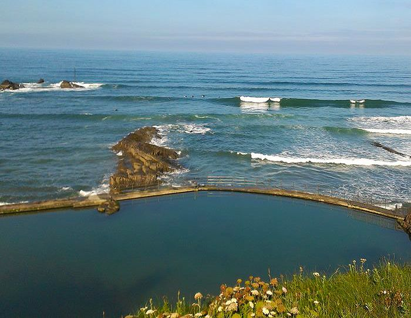
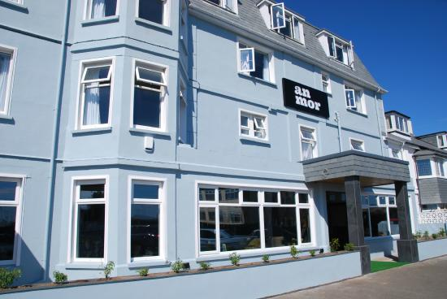
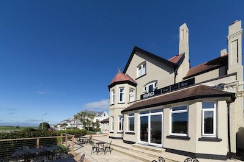

```{r setup, include=FALSE}
knitr::opts_chunk$set(echo = TRUE)
```


```{r}
library(ggmap)
suppressMessages(library("tidyverse"))
```

#Road map of Bude 
```{r}
map_road <- get_googlemap(center =c(-4.543678,50.82664), zoom = 14, maptype = "roadmap")
ggmap(map_road)
```

#Watercolor map of Bude 
```{r}
map_watercolor <- get_map(location =c(-4.543678,50.82664),source="stamen", zoom = 14, maptype = "watercolor")
ggmap(map_watercolor)
```

## Road map
#Red: Summerleaze Beach 
#Blue: Bude North Cornwall Cricket Club
#Green: Crooklets Beach
#Yellow: Bude tidal swimming pool
#Orange: An Mor Hotel
#Black: Hebasca Hotel
```{r}
ggmap(map_road) +
  geom_point(
    aes(x = -4.551312 , y = 50.83074),
    color = "red", size = 2) +
  geom_point(
    aes(x =  -4.552314 , y = 50.835289),
    color = "blue", size = 2) +
  geom_point(
    aes(x = -4.553962 , y = 50.83587),
    color = "green", size = 2) +
  geom_point(
    aes(x = -4.5540, y = 50.8326),
    color = "yellow", size = 2) +
  geom_point(
    aes(x = -4.5510, y = 50.8322),
    color = "orange", size = 2) +
  geom_point(
    aes(x = -4.5528, y = 50.8332),
    color = "black", size = 2)
```

##Watercolor map
```{r}
ggmap(map_watercolor) +
  geom_point(
    aes(x = -4.551312 , y = 50.83074),
    color = "red", size = 2) +
  geom_point(
    aes(x =  -4.552314 , y = 50.835289),
    color = "blue", size = 2) +
  geom_point(
    aes(x = -4.553962 , y = 50.83587),
    color = "green", size = 2) +
  geom_point(
    aes(x = -4.5540, y = 50.8326),
    color = "yellow", size = 2) +
  geom_point(
    aes(x = -4.5510, y = 50.8322),
    color = "orange", size = 2) +
  geom_point(
    aes(x = -4.5528, y = 50.8332),
    color = "black", size = 2)
```

# Maps with routes
```{r}
from <- "Bude North Cornwall Cricket Club"
to <- "Crooklets Inn"
route_df <- route(from, to,structure = "route")
ggmap(map_road) + 
  geom_point(aes(x =  -4.552314 , y = 50.835289), color = "red", size = 2) +
  geom_point(aes(x = -4.5510, y = 50.8362), color = "brown", size = 2) +
  geom_path(aes(x = lon, y = lat), colour = "blue", size = 1, data = route_df, lineend = "round")
```

# Watercolor map with routes
```{r}
ggmap(map_watercolor) + 
  geom_point(aes(x =  -4.552314 , y = 50.835289), color = "red", size = 2) +
  geom_point(aes(x = -4.5510, y = 50.8362), color = "brown", size = 2) +
  geom_path(aes(x = lon, y = lat), colour = "blue", size = 1, data = route_df, lineend = "round")
```
##Images
#Summerleaze Beach


#Crooklets Beach


#Bude North Cornwall Cricket Club


#Bude tidal swimming pool


#An Mor Hotel

You’d never know this hotel is located in the town centre! On a quiet cul-de-sac road above Summerleaze Beach, front facing rooms boast stunning views.

An Mor offers guests the comfort of a first class hotel, made all the more special by rooms that are peppered with local touches and thoughtful design.

Rooms come in all shapes and sizes, many with stunning views. Choose from Luxury, Superior, Standard or you can go for a family suite.

Looking for a venue for your special event? Wedding, birthday party or Christening? Get in touch, we have just the place.



#Hebasca Hotel

Fully refurbished in 2013, Hebasca features 23 super-slick bedrooms, each of which has the individual character you would expect from a luxury hotel in Cornwall. Contemporary yet rich and comfortable, Hebasca is a heady mix of exposed brick, cloud-coloured walls and slate backdrops.

More than just a hotel in Bude, Hebasca is an exciting and vibrant lifestyle choice. With a bold cocktail bar and a laid-back-to-the-nines grill restaurant in Bude, Hebasca is a playful yet elegant indulgence for all the senses. Most importantly the hotel in Bude is your perfect partner, whether seeking a hotel in North Cornwall for business or pleasure.

